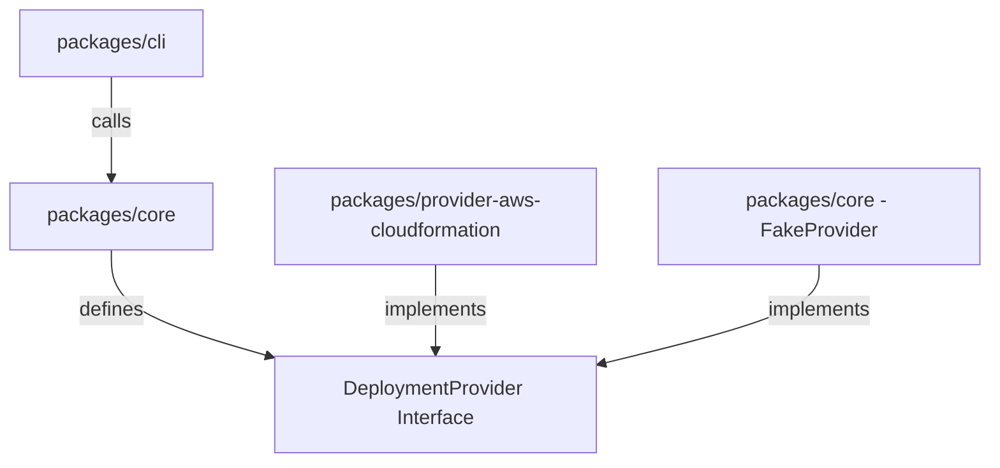

# StackTest Architecture

StackTest is built using a decoupled architecture to ensure the core test orchestration pipeline remains completely separate from cloud-specific providers and deployment frameworks.

---

## Core System Boundaries

### 1. `packages/cli`
The CLI is a thin entry point wrapper. It is responsible for parsing arguments, invoking the core functions, and formatting/printing output. It contains zero deployment logic.

### 2. `packages/core`
The core engine contains all provider-agnostic features:
- **Config Parser**: Loads and validates configurations.
- **Planner**: Resolves tests, targets, and region expansions to build execution matrices.
- **Orchestrator**: Manages concurrency and task scheduling.
- **Dynamic Resolver**: Parses and generates input values (UUIDs, passwords) on-the-fly.

### 3. `packages/provider-aws-cloudformation`
The first external provider package, encapsulating the AWS SDK v3 client configuration, regional template staging via S3, stack polling lifecycle, rollback logs gathering, and cleanup guardrails.

---

## Key Architectural Decisions

- **ESM-First**: Workspace targets are compiled to ES Modules to leverage standard Node.js module loading features natively.
- **Tag-Scoped Destructive Actions**: Every resource deleted by StackTest must possess explicit ownership metadata tags. Cleanup logic is banned from deleting untagged resources.
- **Mock-First Local Development**: All unit tests are executed using simulated fakes to keep development fast, isolated, and safe.
