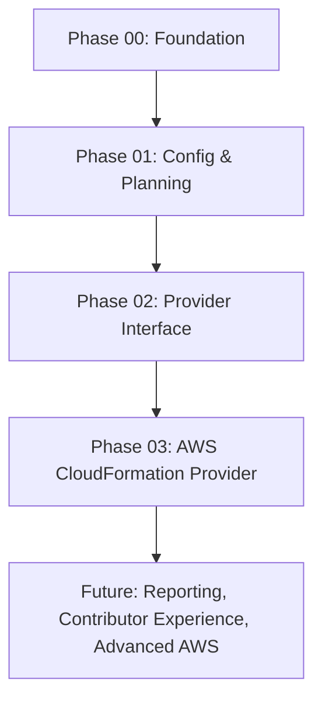

# StackTest Master Backlog

This document acts as the central execution backlog for the StackTest framework. It tracks all phases, individual GitHub issues, status, and recommended developer agent roles.

---

## Roadmap Overview

---

## Phase 00: Foundation

**Goal**: Initialize a clean public open-source TypeScript monorepo with pnpm workspaces, basic command line entrypoints, and solid repository governance.  
_Detailed Plan_: [docs/phases/phase-00-foundation.md](file:///Users/srikanth/Desktop/Personal/Github/stacktest/docs/phases/phase-00-foundation.md)

| Issue ID | Task Name                                                                                                                                           | Recommended Agent Role | Target Commit Prefix | Status   |
| :------- | :-------------------------------------------------------------------------------------------------------------------------------------------------- | :--------------------- | :------------------- | :------- |
| **#0.1** | [Initialize Monorepo Project Structure](file:///Users/srikanth/Desktop/Personal/Github/stacktest/docs/phases/phase-00-foundation.md)                | Architect              | `chore:`             | [x] Done |
| **#0.2** | [Add Repository Governance and Contributor Guidelines](file:///Users/srikanth/Desktop/Personal/Github/stacktest/docs/phases/phase-00-foundation.md) | Documentation          | `docs:`              | [x] Done |
| **#0.3** | [Setup Linter, Formatter, and Unit Testing Tools](file:///Users/srikanth/Desktop/Personal/Github/stacktest/docs/phases/phase-00-foundation.md)      | Test                   | `chore:`             | [x] Done |
| **#0.4** | [Implement CLI Skeleton with Version Query Command](file:///Users/srikanth/Desktop/Personal/Github/stacktest/docs/phases/phase-00-foundation.md)    | Implementation         | `feat(cli):`         | [x] Done |
| **#0.5** | [Setup GitHub Actions CI Workflow](file:///Users/srikanth/Desktop/Personal/Github/stacktest/docs/phases/phase-00-foundation.md)                     | Documentation          | `chore:`             | [x] Done |

---

## Phase 01: Configuration and Planning

**Goal**: Implement local YAML parsing, schema definition, structural error reporting, and deterministic matrix planning without external cloud communication.  
_Detailed Plan_: [docs/phases/phase-01-config-and-planning.md](file:///Users/srikanth/Desktop/Personal/Github/stacktest/docs/phases/phase-01-config-and-planning.md)

| Issue ID | Task Name                                                                                                                                          | Recommended Agent Role | Target Commit Prefix | Status   |
| :------- | :------------------------------------------------------------------------------------------------------------------------------------------------- | :--------------------- | :------------------- | :------- |
| **#1.1** | [Define Configuration Schema Models](file:///Users/srikanth/Desktop/Personal/Github/stacktest/docs/phases/phase-01-config-and-planning.md)         | Architect              | `feat(core):`        | [x] Done |
| **#1.2** | [Implement Config Loader and YAML Validator](file:///Users/srikanth/Desktop/Personal/Github/stacktest/docs/phases/phase-01-config-and-planning.md) | Implementation         | `feat(core):`        | [x] Done |
| **#1.3** | [Add `stacktest lint` Command to CLI](file:///Users/srikanth/Desktop/Personal/Github/stacktest/docs/phases/phase-01-config-and-planning.md)        | Implementation         | `feat(cli):`         | [x] Done |
| **#1.4** | [Implement Deterministic Planning Engine](file:///Users/srikanth/Desktop/Personal/Github/stacktest/docs/phases/phase-01-config-and-planning.md)    | Architect              | `feat(core):`        | [x] Done |
| **#1.5** | [Add `stacktest plan` Command to CLI](file:///Users/srikanth/Desktop/Personal/Github/stacktest/docs/phases/phase-01-config-and-planning.md)        | Implementation         | `feat(cli):`         | [x] Done |

---

## Phase 02: Provider Interface and Orchestration

**Goal**: Design the provider abstraction, implement run orchestration scheduling, support dynamic values, and create a simulated Fake Provider.  
_Detailed Plan_: [docs/phases/phase-02-provider-interface.md](file:///Users/srikanth/Desktop/Personal/Github/stacktest/docs/phases/phase-02-provider-interface.md)

| Issue ID | Task Name                                                                                                                                                    | Recommended Agent Role | Target Commit Prefix | Status   |
| :------- | :----------------------------------------------------------------------------------------------------------------------------------------------------------- | :--------------------- | :------------------- | :------- |
| **#2.1** | [Define `DeploymentProvider` and Results Interfaces](file:///Users/srikanth/Desktop/Personal/Github/stacktest/docs/phases/phase-02-provider-interface.md)    | Architect              | `feat(core):`        | [x] Done |
| **#2.2** | [Implement `ProviderRegistry` Engine](file:///Users/srikanth/Desktop/Personal/Github/stacktest/docs/phases/phase-02-provider-interface.md)                   | Architect              | `feat(core):`        | [x] Done |
| **#2.3** | [Implement `DynamicValueParser` and Built-in Resolvers](file:///Users/srikanth/Desktop/Personal/Github/stacktest/docs/phases/phase-02-provider-interface.md) | Implementation         | `feat(core):`        | [x] Done |
| **#2.4** | [Build the Mock `FakeProvider`](file:///Users/srikanth/Desktop/Personal/Github/stacktest/docs/phases/phase-02-provider-interface.md)                         | Test                   | `feat(core):`        | [x] Done |
| **#2.5** | [Implement Run Orchestrator](file:///Users/srikanth/Desktop/Personal/Github/stacktest/docs/phases/phase-02-provider-interface.md)                            | Implementation         | `feat(core):`        | [x] Done |
| **#2.6** | [Connect CLI `run` Command with Console Reporter](file:///Users/srikanth/Desktop/Personal/Github/stacktest/docs/phases/phase-02-provider-interface.md)       | Implementation         | `feat(cli):`         | [x] Done |

---

## Phase 03: AWS CloudFormation Provider

**Goal**: Integrate the first concrete deployment target (AWS CloudFormation) utilizing credentials loading, regional S3 storage, deployment event polling, and tag-scoped deletion.  
_Detailed Plan_: [docs/phases/phase-03-aws-cloudformation-provider.md](file:///Users/srikanth/Desktop/Personal/Github/stacktest/docs/phases/phase-03-aws-cloudformation-provider.md)

| Issue ID | Task Name                                                                                                                                                        | Recommended Agent Role | Target Commit Prefix                 | Status   |
| :------- | :--------------------------------------------------------------------------------------------------------------------------------------------------------------- | :--------------------- | :----------------------------------- | :------- |
| **#3.1** | [Initialize `provider-aws-cloudformation` Package](file:///Users/srikanth/Desktop/Personal/Github/stacktest/docs/phases/phase-03-aws-cloudformation-provider.md) | Architect              | `chore:`                             | [x] Done |
| **#3.2** | [Implement AWS Credential and Region Resolver](file:///Users/srikanth/Desktop/Personal/Github/stacktest/docs/phases/phase-03-aws-cloudformation-provider.md)     | Safety                 | `feat(provider-aws-cloudformation):` | [x] Done |
| **#3.3** | [Implement S3 Artifact Upload Manager](file:///Users/srikanth/Desktop/Personal/Github/stacktest/docs/phases/phase-03-aws-cloudformation-provider.md)             | Implementation         | `feat(provider-aws-cloudformation):` | [x] Done |
| **#3.4** | [Implement Stack Deployer and Event Poller](file:///Users/srikanth/Desktop/Personal/Github/stacktest/docs/phases/phase-03-aws-cloudformation-provider.md)        | Implementation         | `feat(provider-aws-cloudformation):` | [x] Done |
| **#3.5** | [Implement Event Failure Extractor](file:///Users/srikanth/Desktop/Personal/Github/stacktest/docs/phases/phase-03-aws-cloudformation-provider.md)                | Test                   | `feat(provider-aws-cloudformation):` | [x] Done |
| **#3.6** | [Implement Stack Destroyer with Safety Guardrails](file:///Users/srikanth/Desktop/Personal/Github/stacktest/docs/phases/phase-03-aws-cloudformation-provider.md) | Safety                 | `feat(provider-aws-cloudformation):` | [x] Done |
| **#3.7** | [Add Opt-In Integration Tests](file:///Users/srikanth/Desktop/Personal/Github/stacktest/docs/phases/phase-03-aws-cloudformation-provider.md)                     | Test                   | `test(provider-aws-cloudformation):` | [x] Done |

---

## Phase 04: Reporting and Dashboarding

**Goal**: Generate useful local JSON, JUnit XML, and beautiful interactive HTML report dashboards for test executions.  
_Detailed Plan_: [docs/phases/phase-04-reporting.md](file:///Users/srikanth/Desktop/Personal/Github/stacktest/docs/phases/phase-04-reporting.md)

| Issue ID | Task Name                                                                                                                                      | Recommended Agent Role | Target Commit Prefix | Status   |
| :------- | :--------------------------------------------------------------------------------------------------------------------------------------------- | :--------------------- | :------------------- | :------- |
| **#4.1** | [Extend Result Interfaces and Event Collection](file:///Users/srikanth/Desktop/Personal/Github/stacktest/docs/phases/phase-04-reporting.md)    | Architect              | `feat(core):`        | [x] Done |
| **#4.2** | [Implement Core Report Generator Engine](file:///Users/srikanth/Desktop/Personal/Github/stacktest/docs/phases/phase-04-reporting.md)           | Implementation         | `feat(core):`        | [x] Done |
| **#4.3** | [Build Premium HTML Dashboard Report](file:///Users/srikanth/Desktop/Personal/Github/stacktest/docs/phases/phase-04-reporting.md)              | Implementation         | `feat(core):`        | [x] Done |
| **#4.4** | [Integrate Report Generation into CLI Run Command](file:///Users/srikanth/Desktop/Personal/Github/stacktest/docs/phases/phase-04-reporting.md) | Implementation         | `feat(cli):`         | [x] Done |

---

## Phase 05: Contributor Experience

**Goal**: Make it seamless and safe for external developers to contribute to the StackTest project, write and register custom deployment providers, run monorepo workflows locally, and maintain core decoupling through ADRs.  
_Detailed Plan_: [docs/phases/phase-05-contributor.md](file:///Users/srikanth/Desktop/Personal/Github/stacktest/docs/phases/phase-05-contributor.md)

| Issue ID | Task Name                                                                                                                                              | Recommended Agent Role | Target Commit Prefix | Status   |
| :------- | :----------------------------------------------------------------------------------------------------------------------------------------------------- | :--------------------- | :------------------- | :------- |
| **#5.1** | [Create Local Development and Provider Authoring Guides](file:///Users/srikanth/Desktop/Personal/Github/stacktest/docs/phases/phase-05-contributor.md) | Documentation          | `docs:`              | [ ] Todo |
| **#5.2** | [Set Up GitHub Issue and PR Templates](file:///Users/srikanth/Desktop/Personal/Github/stacktest/docs/phases/phase-05-contributor.md)                   | Documentation          | `chore:`             | [ ] Todo |
| **#5.3** | [Document Architecture Decision Record (ADR 0001)](file:///Users/srikanth/Desktop/Personal/Github/stacktest/docs/phases/phase-05-contributor.md)       | Architect              | `docs:`              | [ ] Todo |

---

## Future Execution Phases (Post-MVP)

### Phase 06: Advanced AWS Compatibility

- **Goal**: Enable cross-account capabilities, parameter overrides, stack update testing scenarios, dynamic IAM roles, and VPC configuration validation.
- **Key Deliverables**: Custom multi-account authentication, live configuration update hooks.
