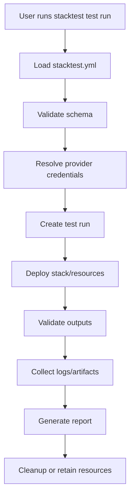

# StackTest Documentation Portal — Agent Design & Implementation Plan

**Repo:** https://github.com/gattasrikanth/stacktest  
**Target docs URL:** `https://gattasrikanth.github.io/stacktest/`  
**Primary goal:** Create a modern, searchable, user-friendly, always-current documentation portal for StackTest, inspired by high-quality public docs such as taskcat and Webull OpenAPI docs.

---

## 1. Product Vision

StackTest should not feel like a random open-source repo with a long README. It should feel like a polished developer product.

The documentation must help four audiences:

1. **New users** — understand what StackTest does and run the first test quickly.
2. **Cloud/IaC engineers** — understand configuration, providers, workflows, test execution, outputs, reports, and CI/CD usage.
3. **Contributors** — understand architecture, coding standards, testing requirements, release workflow, and how to safely add features.
4. **AI coding agents** — understand the repo structure, invariants, docs update rules, and implementation boundaries without drifting from the source code.

Documentation is part of the product. Every meaningful source-code change must either update the docs or explicitly prove no docs change is required.

---

## 2. Inspiration & UX Direction

### taskcat-style documentation patterns to copy

StackTest should include:

- Homepage with a clear one-sentence value proposition.
- Prominent **Get Started** and **Install** calls to action.
- Left sidebar navigation.
- Search box.
- Quick Start example.
- Configuration reference.
- Dynamic values / runtime values documentation if implemented.
- Schema reference.
- API / CLI reference.
- Troubleshooting guide.
- Examples section.
- CI/CD examples.
- “What’s New” or changelog section.

### Webull-style documentation patterns to copy

StackTest should include:

- Welcome page.
- Documentation section.
- API Reference section.
- Recipes section.
- Change Log section.
- SDKs / tools section when packages are created.
- AI-friendly resources section, especially because this repo is being built heavily through agentic development.

---

## 3. Recommended Technical Choice

### Primary recommendation: Docusaurus

Use **Docusaurus** for the docs portal.

Why:

- TypeScript/React-friendly.
- Good for product-style documentation.
- Supports Markdown and MDX.
- Supports custom React components when needed.
- Supports search integrations.
- Supports versioned docs later when StackTest reaches stable releases.
- Works cleanly with GitHub Pages.

### Alternative: MkDocs Material

MkDocs Material is a strong alternative if the team wants a closer taskcat-style experience. However, because StackTest is planned as a TypeScript-first project, Docusaurus is the better default.

### Placement in repo

Create the docs site under:

```text
website/
```

Example structure:

```text
stacktest/
  src/
  tests/
  examples/
  schemas/
  docs/
    adr/
    design/
  website/
    docs/
    src/
    static/
    docusaurus.config.ts
    sidebars.ts
    package.json
  .github/
    workflows/
      docs.yml
      docs-quality.yml
```

Use `website/` for the public documentation site. Keep long-form internal design docs in root `/docs/design` or `/docs/adr`, then selectively publish polished versions into `website/docs`.

---

## 4. Required Documentation Information Architecture

The first production version of the docs portal must have this navigation structure.

```text
Home
Getting Started
  - What is StackTest?
  - Installation
  - Quick Start
  - Your First Stack Test
  - Project Layout
Core Concepts
  - Test Projects
  - Test Runs
  - Providers
  - Regions / Locations
  - Parameters
  - Artifacts
  - Reports
  - Cleanup / Destroy
Configuration
  - stacktest.yml Overview
  - Project Configuration
  - Test Configuration
  - Provider Configuration
  - Parameters and Overrides
  - Dynamic Values
  - Environment Variables
  - Secrets Handling
  - Full Configuration Reference
CLI Reference
  - stacktest init
  - stacktest test run
  - stacktest test list
  - stacktest report
  - stacktest clean
  - stacktest destroy
  - Global Flags
Examples
  - Minimal AWS Example
  - Multi-Region AWS Example
  - Multi-Account AWS Example
  - Future Azure Example
  - Future GCP Example
  - GitHub Actions Example
  - Local Development Example
Recipes
  - Validate a CloudFormation Template
  - Run Tests in Multiple Regions
  - Override Parameters per Region
  - Generate an HTML Report
  - Clean Up Failed Runs
  - Use StackTest in CI
Reports
  - HTML Report Overview
  - JSON Report Schema
  - Failure Diagnostics
  - Logs and Artifacts
Architecture
  - System Overview
  - Package Structure
  - Provider Plugin Model
  - Test Lifecycle
  - Error Handling
  - Logging and Telemetry
  - Security Model
API Reference
  - TypeScript API Overview
  - Public Types
  - Provider Interfaces
  - Runner API
  - Report API
Schema Reference
  - stacktest.yml JSON Schema
  - Generated Schema Docs
Contributing
  - Development Setup
  - Coding Standards
  - Testing Strategy
  - Pull Request Rules
  - Documentation Rules
  - Agentic Development Protocol
AI-Friendly Resources
  - Repository Map
  - Agent Instructions
  - Source of Truth Rules
  - Common Tasks for Agents
  - Docs Sync Checklist
Troubleshooting
  - Install Issues
  - AWS Credential Issues
  - CloudFormation Failures
  - Cleanup Failures
  - GitHub Pages Build Failures
  - Known Limitations
Release Notes
  - Changelog
  - Roadmap
```

---

## 5. Homepage Requirements

The homepage must answer these questions in less than 30 seconds:

1. What is StackTest?
2. Who is it for?
3. What problem does it solve?
4. How do I install it?
5. How do I run my first test?
6. Where do I find examples?
7. How do I contribute?

### Homepage sections

Required sections:

- Hero banner:
  - Title: `StackTest`
  - Subtitle: `Multi-cloud infrastructure testing for modern IaC projects.`
  - Buttons: `Get Started`, `View on GitHub`
- Feature cards:
  - Multi-cloud ready
  - TypeScript-first
  - CI/CD friendly
  - Rich reports
  - Config-driven
  - Agent-friendly development
- Quick Start code block.
- Example `stacktest.yml`.
- “Why StackTest?” section.
- “Current status” callout: Alpha / work-in-progress until first stable release.
- Links to docs, examples, GitHub issues, discussions if enabled.

---

## 6. Documentation Content Standards

Every documentation page must follow this format where possible:

```md
# Page Title

Short explanation of what this page helps the user do.

## When to use this

Explain the scenario.

## Prerequisites

List only what is truly needed.

## Step-by-step

Give copy-pasteable commands and examples.

## Example

Show a real example.

## Expected output

Show what success looks like.

## Common mistakes

List likely failures.

## Related pages

Link to nearby docs.
```

Tone:

- Clear.
- Practical.
- Friendly.
- No marketing fluff beyond the homepage.
- Prefer working examples over abstract explanation.
- Keep pages short enough to scan.
- Add diagrams only when they clarify behavior.

---

## 7. Generated Documentation Requirements

Agents must not hand-maintain documentation that can be generated from source code.

### Generate CLI reference

When the CLI exists, generate command documentation automatically from the CLI command definitions.

Required output:

```text
website/docs/cli/reference.md
```

Each command must include:

- Command name.
- Description.
- Usage.
- Flags.
- Examples.
- Exit codes if applicable.

### Generate TypeScript API reference

Use TypeDoc for public TypeScript APIs.

Required output:

```text
website/docs/api/
```

Rules:

- Only public APIs should appear.
- Internal modules must be excluded.
- Every exported public type must have JSDoc.
- CI must fail if public APIs are undocumented.

### Generate configuration schema docs

When `stacktest.yml` schema exists, maintain JSON Schema and generate docs from it.

Required files:

```text
schemas/stacktest.schema.json
website/docs/schema/stacktest-yml.md
```

Rules:

- The schema is the source of truth for config fields.
- Examples must validate against the schema.
- Docs must include defaults, required fields, allowed values, and examples.

### Generate examples index

The `examples/` folder must be indexed automatically into docs.

Required output:

```text
website/docs/examples/index.md
```

Each example must have:

- Name.
- Provider.
- Purpose.
- Required credentials.
- Run command.
- Expected report output.

---

## 8. Diagrams and Visual Documentation

Use Mermaid diagrams inside Markdown/MDX.

Required diagrams:

1. Test lifecycle.
2. Provider plugin architecture.
3. CLI-to-runner flow.
4. Report generation flow.
5. Cleanup/destroy flow.
6. CI/CD flow with GitHub Actions.

Example lifecycle diagram:



---

## 9. GitHub Pages Deployment

Use GitHub Actions to build and deploy Docusaurus to GitHub Pages.

### Required GitHub Pages settings

- Source: GitHub Actions.
- Site URL: `https://gattasrikanth.github.io/stacktest/`
- Docusaurus `url`: `https://gattasrikanth.github.io`
- Docusaurus `baseUrl`: `/stacktest/`

### Required workflow

Create:

```text
.github/workflows/docs.yml
```

Workflow behavior:

- Run on pull requests touching docs, website, source, schemas, examples, package files, or workflows.
- Run on push to `main`.
- Build docs.
- Upload artifact.
- Deploy only from `main`.

Example workflow skeleton:

```yaml
name: Docs

on:
  push:
    branches: [main]
  pull_request:
    paths:
      - "website/**"
      - "docs/**"
      - "src/**"
      - "examples/**"
      - "schemas/**"
      - "package.json"
      - "pnpm-lock.yaml"
      - ".github/workflows/docs.yml"
  workflow_dispatch:

permissions:
  contents: read
  pages: write
  id-token: write

concurrency:
  group: pages
  cancel-in-progress: false

jobs:
  build:
    runs-on: ubuntu-latest
    steps:
      - uses: actions/checkout@v4
      - uses: actions/setup-node@v4
        with:
          node-version: "22"
          cache: "pnpm"
      - uses: pnpm/action-setup@v4
        with:
          version: 10
      - run: pnpm install --frozen-lockfile
      - run: pnpm docs:generate
      - run: pnpm docs:check
      - run: pnpm --dir website build
      - uses: actions/upload-pages-artifact@v3
        with:
          path: website/build

  deploy:
    if: github.ref == 'refs/heads/main'
    needs: build
    runs-on: ubuntu-latest
    environment:
      name: github-pages
      url: ${{ steps.deployment.outputs.page_url }}
    steps:
      - id: deployment
        uses: actions/deploy-pages@v4
```

Agents must adapt package manager and node version to the actual repo state. Do not blindly add `pnpm` if the repo already standardizes on npm or yarn.

---

## 10. Documentation Quality Gates

Create:

```text
.github/workflows/docs-quality.yml
```

Required checks:

- Markdown lint.
- MDX build validation.
- Link check for internal links.
- Spell check for project terms.
- Mermaid syntax validation if available.
- All examples compile or validate.
- All `stacktest.yml` examples validate against JSON Schema.
- CLI reference is up to date.
- API docs are up to date.
- No broken relative links.
- No TODO placeholders in published docs unless explicitly allowed.
- No secrets, tokens, account IDs, or private local paths.

### Suggested commands

Add scripts like:

```json
{
  "scripts": {
    "docs:dev": "docusaurus start --config website/docusaurus.config.ts",
    "docs:build": "docusaurus build --config website/docusaurus.config.ts",
    "docs:generate": "tsx scripts/generate-docs.ts",
    "docs:check": "pnpm docs:generate && pnpm lint:docs && pnpm docs:build",
    "lint:docs": "markdownlint-cli2 '**/*.md' '**/*.mdx'",
    "docs:links": "lychee website/docs/**/*.md website/docs/**/*.mdx README.md"
  }
}
```

Agents must adjust commands to match actual package structure.

---

## 11. Keep Documentation in Sync With Source Code

This is a hard requirement.

Every pull request or direct main-branch commit that changes product behavior must update docs.

### Docs sync rule

For each code change, agents must classify docs impact:

```text
DOCS IMPACT: required
DOCS IMPACT: not required
DOCS IMPACT: generated only
```

If `required`, update docs in the same commit or PR.

If `not required`, explain why in the commit message or PR summary.

If `generated only`, run the docs generator and commit generated changes.

### Required docs sync checklist

Create:

```text
.github/pull_request_template.md
```

Include:

```md
## Documentation impact

- [ ] User-facing behavior changed and docs were updated
- [ ] CLI behavior changed and CLI docs were regenerated
- [ ] Config schema changed and schema docs/examples were updated
- [ ] Public API changed and TypeDoc docs were regenerated
- [ ] Examples changed and examples index was regenerated
- [ ] No docs update required because: <!-- explain -->
```

### Required agent instruction

Add to `AGENTS.md`:

```md
## Documentation sync rule

Before finishing any task, inspect the diff and decide whether docs are impacted.
If source behavior, CLI commands, config fields, public APIs, examples, architecture, errors, or setup steps changed, update the documentation in the same change.
Run docs generation and docs quality checks before committing.
Never leave documentation stale intentionally.
```

---

## 12. AI-Friendly Documentation Section

Because this project is expected to use agentic development, create an explicit AI-friendly section.

Required page:

```text
website/docs/ai/agent-guide.md
```

It must include:

- Repo map.
- Source-of-truth rules.
- How to add a feature.
- How to update docs.
- How to regenerate API/CLI/schema docs.
- How to run tests.
- How to avoid stale documentation.
- What not to change without explicit approval.
- Known architecture invariants.

Required page:

```text
website/docs/ai/source-of-truth.md
```

Content rules:

- Config fields: schema is source of truth.
- CLI commands: CLI definitions are source of truth.
- Public APIs: TypeScript exports and JSDoc are source of truth.
- Examples: `/examples` folder is source of truth.
- Architecture: ADRs and design docs are source of truth.
- Published docs should be generated or checked against these sources.

---

## 13. README Integration

The root `README.md` must be short and polished.

It should include:

- Project name.
- One-sentence description.
- Current status badge.
- Docs badge/link.
- Build/test badges once workflows exist.
- Quick install.
- Quick start.
- Link to full docs.
- Link to contributing guide.

The README should not duplicate the full docs portal. It should route readers to the documentation site.

Example README top section:

```md
# StackTest

Multi-cloud infrastructure testing for modern IaC projects.

[Documentation](https://gattasrikanth.github.io/stacktest/) · [Quick Start](https://gattasrikanth.github.io/stacktest/docs/getting-started/quick-start) · [Contributing](./CONTRIBUTING.md)
```

---

## 14. Changelog and Release Notes

Use a changelog from the start.

Required file:

```text
CHANGELOG.md
```

Required docs page:

```text
website/docs/release-notes/changelog.md
```

The docs changelog may be copied or generated from `CHANGELOG.md`.

Recommended format:

```md
# Changelog

## Unreleased

### Added

### Changed

### Fixed

### Removed

## 0.1.0 - YYYY-MM-DD
```

Agents must update changelog for user-visible changes.

---

## 15. Versioning Strategy

Do not enable Docusaurus versioned docs immediately unless the project has a stable public release.

Initial approach:

- Publish only current docs.
- Use changelog for release history.
- Add versioned docs after `v1.0.0` or when breaking changes become common.

When versioning is introduced:

- Keep latest stable at `/docs/`.
- Keep unreleased docs at `/docs/next/`.
- Limit active versions to avoid maintenance burden.

---

## 16. Search Strategy

Phase 1:

- Use local search plugin if suitable.
- Ensure all docs pages have useful titles, descriptions, and headings.

Phase 2:

- Add Algolia DocSearch if public docs are accepted and indexed.

Search requirements:

- Users should be able to search for CLI commands, config fields, error messages, providers, examples, and troubleshooting topics.
- Error messages should appear in docs exactly as emitted by the CLI whenever possible.

---

## 17. Security and Privacy Rules

Published docs must never contain:

- Real AWS account IDs.
- Real access keys.
- Real secret names from private environments.
- Private local machine paths.
- Internal-only URLs.
- Personal credentials.
- Screenshots with sensitive data.

Use safe placeholders:

```text
123456789012
us-east-1
example-bucket
STACKTEST_EXAMPLE_ROLE_ARN
```

All docs examples must prefer least-privilege language and clearly warn before destructive cleanup/destroy commands.

---

## 18. Accessibility and UX Requirements

Docs must be easy to read.

Required UX rules:

- Use descriptive headings.
- Avoid huge walls of text.
- Use tabs for OS/package-manager differences if needed.
- Use admonitions for warnings and tips.
- Use alt text for images.
- Ensure dark mode works.
- Keep code blocks copy-pasteable.
- Include expected output for important commands.
- Add “Next steps” links at the bottom of main pages.

---

## 19. Agent Roles

Assign agents logically. One physical AI agent may perform multiple roles, but it must report work in these role categories.

### 1. Documentation Architect Agent

Responsibilities:

- Create Docusaurus site structure.
- Define nav/sidebar.
- Ensure docs match product direction.
- Keep docs concise and discoverable.

### 2. Docs Infrastructure Agent

Responsibilities:

- Add `website/` Docusaurus project.
- Configure GitHub Pages build.
- Configure base URL.
- Add docs workflows.
- Add local dev scripts.

### 3. Source-to-Docs Automation Agent

Responsibilities:

- Generate CLI docs.
- Generate TypeScript API docs.
- Generate schema docs.
- Generate examples index.
- Add checks that fail on stale generated docs.

### 4. Content Agent

Responsibilities:

- Write getting-started docs.
- Write conceptual docs.
- Write examples and recipes.
- Write troubleshooting pages.
- Keep language simple.

### 5. Architecture Documentation Agent

Responsibilities:

- Write system overview.
- Write ADRs.
- Add Mermaid diagrams.
- Keep architecture docs aligned with code.

### 6. QA Documentation Agent

Responsibilities:

- Run docs build.
- Run markdown lint.
- Run link checker.
- Validate examples.
- Check accessibility basics.

### 7. Release Documentation Agent

Responsibilities:

- Maintain changelog.
- Maintain release notes.
- Update version references.
- Keep README badges and links current.

---

## 20. Implementation Phases

### Phase 0 — Repo audit

Goal: understand current repo state before adding docs.

Agent tasks:

1. Inspect repo structure.
2. Identify package manager.
3. Identify build/test/lint commands.
4. Identify existing README/docs.
5. Identify current CLI/config/API surface if any.
6. Write a short audit summary before changing files.

Deliverable:

```text
docs/design/docs-portal-audit.md
```

### Phase 1 — Docs portal foundation

Goal: create the working docs site.

Agent tasks:

1. Add Docusaurus under `website/`.
2. Configure site title, tagline, favicon placeholder, navbar, footer, sidebar.
3. Set GitHub Pages URL/baseUrl.
4. Add homepage.
5. Add initial docs structure with placeholder pages only where needed.
6. Add local docs commands.
7. Confirm `docs:build` passes.

Deliverables:

```text
website/
website/docusaurus.config.ts
website/sidebars.ts
website/docs/**
package.json docs scripts
```

Acceptance criteria:

- `pnpm docs:build` or equivalent passes.
- Site has homepage, sidebar, search-ready structure.
- No broken internal links.

### Phase 2 — Core documentation content

Goal: publish useful docs even while the project is early.

Agent tasks:

1. Write What is StackTest?
2. Write Installation.
3. Write Quick Start.
4. Write Project Layout.
5. Write Core Concepts overview.
6. Write Contributing overview.
7. Write Agent Guide.
8. Write Troubleshooting starter page.

Acceptance criteria:

- A new visitor can understand the project and run the first intended workflow.
- Docs clearly mark alpha/in-progress features.
- No fake commands unless explicitly marked as planned.

### Phase 3 — Generated docs automation

Goal: prevent stale docs.

Agent tasks:

1. Add script to generate CLI docs when CLI exists.
2. Add TypeDoc for public TypeScript APIs when exports exist.
3. Add schema docs generator when config schema exists.
4. Add examples index generator.
5. Add docs freshness checks.
6. Add PR template docs checklist.
7. Update `AGENTS.md` with docs sync rules.

Acceptance criteria:

- Generated docs are reproducible.
- CI fails if generated docs are stale.
- Agents have explicit rules for docs updates.

### Phase 4 — GitHub Pages deployment

Goal: publish docs from `main`.

Agent tasks:

1. Add `.github/workflows/docs.yml`.
2. Add `.github/workflows/docs-quality.yml` if separate.
3. Configure GitHub Pages instructions in docs.
4. Verify Pages source is GitHub Actions.
5. Confirm deployed URL after first successful run.

Acceptance criteria:

- Docs deploy successfully from `main`.
- Pull requests build docs without deploying.
- README links to live docs.

### Phase 5 — Examples, recipes, and reports docs

Goal: make docs practical.

Agent tasks:

1. Add real examples as product features stabilize.
2. Add recipes for common workflows.
3. Add report screenshots or sample report JSON.
4. Add failure examples and troubleshooting fixes.
5. Add CI/CD guides.

Acceptance criteria:

- Users can copy/paste examples.
- Examples are tested or schema-validated.
- Troubleshooting pages include real error messages.

### Phase 6 — Polish and release-readiness

Goal: make docs feel production-grade.

Agent tasks:

1. Add branding polish.
2. Add logo placeholder or simple generated SVG.
3. Add badges.
4. Add SEO metadata.
5. Add social preview image if needed.
6. Add 404 page.
7. Add roadmap.
8. Add changelog/release notes.

Acceptance criteria:

- Docs feel modern and complete.
- Navigation is intuitive.
- Search works.
- Public repo README routes users cleanly to docs.

---

## 21. First Agent Prompt to Start Implementation

Use this prompt after committing this design doc:

```text
You are working in the public StackTest repo.

Goal: implement the documentation portal foundation from docs/design/stacktest-docs-portal-design.md.

Before changing files:
1. Inspect the repo structure.
2. Identify the package manager and existing scripts.
3. Identify whether AGENTS.md, README.md, docs/, examples/, schemas/, and .github/workflows already exist.
4. Create docs/design/docs-portal-audit.md with your findings and proposed exact file changes.

Then implement Phase 1 only:
- Add a Docusaurus docs site under website/.
- Configure it for GitHub Pages project URL: https://gattasrikanth.github.io/stacktest/.
- Add the initial docs navigation structure.
- Add a polished homepage.
- Add starter pages for Getting Started, Core Concepts, Configuration, CLI Reference, Examples, Recipes, Architecture, API Reference, Schema Reference, Contributing, AI-Friendly Resources, Troubleshooting, and Release Notes.
- Add local scripts to build and run docs.
- Add docs build workflow for GitHub Pages.
- Update README.md with a short docs link section.

Rules:
- Do not invent completed product behavior. Mark future/planned features clearly.
- Do not add fake CLI commands as if implemented.
- If CLI/config/API does not exist yet, create placeholder docs that say the section will be generated once implemented.
- Keep docs user-friendly and modern.
- Run the docs build before committing.
- Commit changes with a clear message.
```

---

## 22. Ongoing Agent Prompt for Every Feature Change

Use this prompt for future feature work:

```text
Before implementing this feature, read AGENTS.md and the docs sync rules.

After implementation:
1. Inspect the full git diff.
2. Identify whether user-facing behavior, CLI commands, config schema, examples, public APIs, reports, errors, setup, or architecture changed.
3. Update the relevant docs in the same change.
4. Regenerate CLI/API/schema/example docs if applicable.
5. Update CHANGELOG.md for user-visible changes.
6. Run tests and docs quality checks.
7. In your final summary, include:
   - Code changes
   - Docs changes
   - Tests run
   - Docs impact classification
   - Any follow-up needed

Do not commit stale docs.
```

---

## 23. Acceptance Criteria for the Whole Documentation Feature

The documentation feature is complete when:

- Live docs are available at `https://gattasrikanth.github.io/stacktest/`.
- README links to live docs.
- Docs build automatically on pull requests.
- Docs deploy automatically from `main`.
- Docs have a clear sidebar and homepage.
- Docs include getting started, configuration, CLI, examples, architecture, contributing, AI guide, troubleshooting, and changelog sections.
- Docs explain which features are implemented vs planned.
- Generated docs exist for CLI/API/schema when those source surfaces exist.
- CI catches stale generated docs.
- PR template requires docs impact classification.
- AGENTS.md tells agents to update docs with code changes.
- No secrets or private machine details are published.

---

## 24. Recommended Initial Commit Sequence

Use small commits so agent handoff is easy.

1. `docs: add documentation portal design plan`
2. `docs: add docs portal audit`
3. `docs: add docusaurus website foundation`
4. `docs: add getting started and project overview pages`
5. `ci: add github pages docs workflow`
6. `docs: add agent documentation sync rules`
7. `docs: add generated docs placeholders`
8. `docs: polish homepage and navigation`

---

## 25. Non-Goals for First Pass

Do not do these in the first pass:

- Do not build a complex custom documentation theme.
- Do not add versioned docs before stable releases.
- Do not add fake API reference before APIs exist.
- Do not create heavy custom React components unless needed.
- Do not publish private architecture notes that should stay internal.
- Do not block early project progress by over-engineering docs automation before source surfaces exist.

---

## 26. Final Guidance to Agents

The docs must evolve with the product. A beautiful docs portal is useful only if it stays accurate.

Treat documentation like tests:

- If behavior changes, docs change.
- If config changes, schema docs change.
- If CLI changes, CLI docs change.
- If errors change, troubleshooting changes.
- If architecture changes, diagrams and ADRs change.
- If examples break, docs build must fail.

StackTest should become a project where users and contributors can trust the documentation as much as the code.
