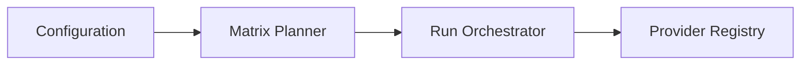

# Architecture Overview

StackTest partitions execution into three decoupled stages:

This guarantees that core systems are entirely decoupled from cloud provider SDK details.

## Local Dashboard

StackTest writes normalized local run artifacts under `.stacktest/runs`. The local dashboard is a web server bound to `127.0.0.1` by default; it reads those artifacts, serves a React UI, and streams active run events with Server-Sent Events. No run data leaves the machine.
